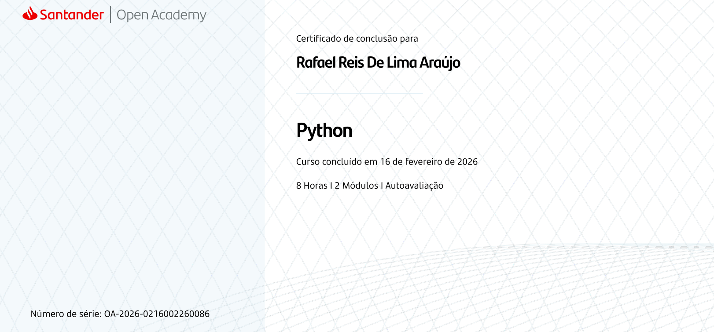

  
  
  <h3>👨‍💻 Estudante de Sistemas de Informação na UNINTER</h3>
  
Focado em desenvolvimento Full-stacks, Sistemas e Banco de Dados.

  

---

### 🚀 Sobre Mim
- 🎓 Cursando **Sistemas de Informação** no Centro Universitário Internacional (UNINTER).
- ☕ Desenvolvedor **Java** Orientado à objetos.
- 🐍 Entusiasta de **Python** para automação e análise de dados.
- 🗄️ Experiência na criação e manipulação de bancos de dados relacionais com **MySQL**.
- 📫 Como me encontrar:(https://www.linkedin.com/in/rafael-reis-ab9123384/) ou pelo próprio GitHub.

---

### 🛠️ Tecnologias e Ferramentas

**Linguagens de Programação:**

  
  
  

**Banco de Dados:**

  

**Outras Ferramentas:**

  
  

## 🏆 Certificações

  

---

### 📂 Meus Destaques
- 📌 **[PraticasEmJava]**: https://github.com/R4FFA-coder/PraticandoJava ® Minha trilha de aprendizado na faculdade, contendo exercícios de lógica e fundamentos da linguagem.

---

  

